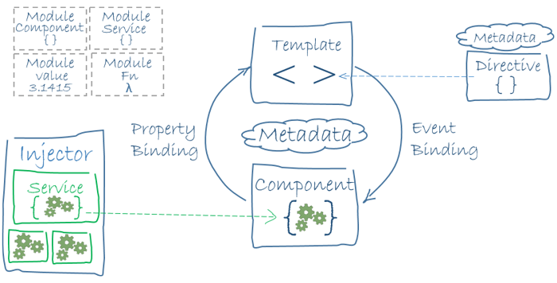

### 架构总览

Angular 是一个用 HTML 和 JavaScript 或者一个可以编译成 JavaScript 的语言（例如 Dart 或者 TypeScript ），来构建客户端应用的框架。

该框架包括一系列库，有些是核心库，有些是可选库。

我们是这样写 Angular 应用的：用 Angular 扩展语法编写 HTML 模板， 用组件类管理这些模板，用服务添加应用逻辑， 用模块打包发布组件与服务。

然后，我们通过引导根模块来启动该应用。 Angular 在浏览器中接管、展现应用的内容，并根据我们提供的操作指令响应用户的交互。

全景图：


#### 1. 模块

Angular 应用是模块化的，并且 Angular 有自己的模块系统，它被称为 Angular 模块或 NgModules。

每个 Angular 应用至少有一个模块（根模块），习惯上命名为AppModule。

根模块在一些小型应用中可能是唯一的模块，大多数应用会有很多特性模块，每个模块都是一个内聚的代码块专注于某个应用领域、工作流或紧密相关的功能。

Angular 模块（无论是根模块还是特性模块）都是一个带有@NgModule装饰器的类。

NgModule是一个装饰器函数，它接收一个用来描述模块属性的元数据对象。其中最重要的属性是：

* declarations - 声明本模块中拥有的视图类。Angular 有三种视图类：组件、指令和管道。
* exports - declarations 的子集，可用于其它模块的组件模板。
* imports - 本模块声明的组件模板需要的类所在的其它模块。
* providers - 服务的创建者，并加入到全局服务列表中，可用于应用任何部分。
* bootstrap - 指定应用的主视图（称为根组件），它是所有其它视图的宿主。只有根模块才能设置bootstrap属性。

>我们通过引导根模块来启动应用。 在开发期间，你通常在一个main.ts文件中引导AppModule

>JavaScript 也有自己的模块系统，用来管理一组 JavaScript 对象。 它与 Angular 的模块系统完全不同且完全无关。

#### 2. 组件

组件负责控制屏幕上的一小块区域，我们称之为视图。

在类中定义组件的应用逻辑，为视图提供支持。 组件通过一些由属性和方法组成的 API 与视图交互。

组件可以嵌套使用。

>组件类应保持精简。组件本身不从服务器获得数据、不进行验证输入，也不直接往控制台写日志。 它们把这些任务委托给服务。

>组件的任务就是提供用户体验，仅此而已。它介于视图（由模板渲染）和应用逻辑（通常包括模型的某些概念）之间。 设计良好的组件为数据绑定提供属性和方法，把其它琐事都委托给服务。

#### 3. 模板

我们通过组件的自带的模板来定义组件视图。模板以 HTML 形式存在，告诉 Angular 如何渲染组件。

多数情况下，模板看起来很像标准 HTML，当然模板可以是HTML文档的部分内容。

#### 4. 元数据
元数据告诉 Angular 如何处理一个类。
例如
```
@Component({
  selector:    'hero-list',
  templateUrl: './hero-list.component.html',
  providers:  [ HeroService ]
})
export class HeroListComponent implements OnInit {
/* . . . */
}
```
@Component里面的元数据会告诉 Angular 从哪里获取你为组件指定的主要的构建块。

模板、元数据和组件共同描绘出这个视图。

其它元数据装饰器用类似的方式来指导 Angular 的行为。 例如@Injectable、@Input和@Output等是一些最常用的装饰器。

#### 5. 数据绑定
四种方式


```
//插值表达式在<li>标签中显示组件的hero.name属性的值。
<li>{{hero.name}}</li>

//属性绑定把父组件HeroListComponent的selectedHero的值传到子组件HeroDetailComponent的hero属性中。
<hero-detail [hero]="selectedHero"></hero-detail>

<li (click)="selectHero(hero)"></li>

//双向绑定
<input [(ngModel)]="hero.name">
```

#### 6. 指令
Angular 模板是动态的。当 Angular 渲染它们时，它会根据指令提供的操作对 DOM 进行转换。

组件是一个带模板的指令；@Component装饰器实际上就是一个@Directive装饰器，只是扩展了一些面向模板的特性。

>虽然严格来说组件就是一个指令，但是组件非常独特，并在 Angular 中位于中心地位，所以在架构概览中，我们把组件从指令中独立了出来。


还有两种其它类型的指令：结构型指令和属性 (attribute) 型指令。

下面的范例模板中用到了两个内置的结构型指令：


```
<li *ngFor="let hero of heroes"></li>
<hero-detail *ngIf="selectedHero"></hero-detail>
```

属性型 指令修改一个现有元素的外观或行为。 在模板中，它们看起来就像是标准的 HTML 属性，故名。

ngModel指令就是属性型指令的一个例子，它实现了双向数据绑定。 ngModel修改现有元素（一般是<input>）的行为：设置其显示属性值，并响应 change 事件。


```
<input [(ngModel)]="hero.name">
```

Angular 还有少量指令，它们或者修改结构布局（例如 ngSwitch）， 或者修改 DOM 元素和组件的各个方面（例如 ngStyle和 ngClass）。

当然，我们也能编写自己的指令。像HeroListComponent这样的组件就是一种自定义指令。

#### 7. 服务
服务是一个广义范畴，包括：值、函数，或应用所需的特性。

几乎任何东西都可以是一个服务。 典型的服务是一个类，具有专注的、明确的用途。它应该做一件特定的事情，并把它做好。

服务仍然是任何 Angular 应用的基础。组件就是最大的服务消费者。
#### 8. 依赖注入

“依赖注入”是提供类的新实例的一种方式，还负责处理好类所需的全部依赖。大多数依赖都是服务。 Angular 使用依赖注入来提供新组件以及组件所需的服务。

Angular 通过查看构造函数的参数类型得知组件需要哪些服务。 例如，HeroListComponent组件的构造函数需要一个HeroService服务：


```
constructor(private service: HeroService) { }
```
当 Angular 创建组件时，会首先为组件所需的服务请求一个注入器 (injector)。

When Angular creates a component, it first asks an injector for the services that the component requires.

注入器维护了一个服务实例的容器，存放着以前创建的实例。 如果所请求的服务实例不在容器中，注入器就会创建一个服务实例，并且添加到容器中，然后把这个服务返回给 Angular。 当所有请求的服务都被解析完并返回时，Angular 会以这些服务为参数去调用组件的构造函数。 这就是依赖注入 。

如果注入器还没有HeroService，它怎么知道该如何创建一个呢？

简单点说，我们必须先用注入器（injector）为HeroService注册一个提供商（provider）。 提供商用来创建或返回服务，通常就是这个服务类本身（相当于new HeroService()）。

我们可以在模块中或组件中注册提供商。

但通常会把提供商添加到根模块上，以便在任何地方都使用服务的同一个实例。

或者，也可以在@Component元数据中的providers属性中把它注册在组件层：

需要记住的关于依赖注入的要点是：

##### 依赖注入渗透在整个 Angular 框架中，被到处使用。

* 注入器 (injector) 是本机制的核心。
    * 注入器负责维护一个容器，用于存放它创建过的服务实例。
    * 注入器能使用提供商创建一个新的服务实例。
* 提供商是一个用于创建服务的配方。
* 把提供商注册到注入器。

